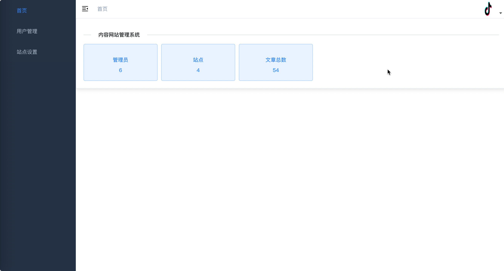

# 企业官网

## 介绍
企业官网，springboot+VUE架构，前后端分离方便拓展，功能包括用户管理、文章管理、管理员管理、站点管理。。。

## 架构
后端API+前端管理+前端用户展示
API
> Springboot+Mybatis—plus+ssdb+hutool
WEB
> VUE+elementUI+BootstrapUI

[sql](./cms.sql)
## 预览
### 后台管理

### 前端展示

